# Mapeo de Base de Datos y Diagrama ER

Fuente revisada:

- `Dump20260127.sql`
- `db/patches/001-fix-azuay-parroquias.sql`
- `db/patches/002-referencia-medica.sql`
- `db/patches/003-agregar-enfermedades-cie10.sql`
- `db/patches/004-anio-escolar.sql`
- Entidades JPA en `backend-hce/src/main/java/ec/gob/salud/hce/backend/entity`

## Observaciones Importantes

La base casi no tiene llaves foraneas declaradas fisicamente. La mayoria de relaciones se infieren por columnas `id_*` y por las entidades JPA.

Tambien hay diferencias entre nombres de tablas en Java y en el dump:

| Entidad Java | `@Table` en Java | Tabla en dump | Estado |
|---|---:|---:|---|
| `Paciente` | `pacientes` | `pacientes` | OK |
| `Consulta` | `consultas` | `consultas` | OK |
| `HistoriaClinica` | `historias_clinicas` | `historias_clinicas` | OK |
| `CardioPulmonar` | `cardio_pulmonares` | `cardiospulmonares` | Revisar |
| `Alimentacion` | `alimentacion` | `alimentaciones` | Revisar |
| `Rol` | `roles` | No aparece en dump | Revisar |

Parches que modifican el esquema inicial:

| Patch | Cambio |
|---|---|
| `002-referencia-medica.sql` | Agrega `pacientes.tipo_identificacion`, `consultas.referencia_hospital`, `consultas.motivo_referencia` |
| `004-anio-escolar.sql` | Agrega `pacientes.anio_escolar` |

## Mapeo General

| Tabla | PK | Relaciones principales |
|---|---|---|
| `pacientes` | `id_paciente` | Grupo etnico, parroquia/canton/provincia, historia clinica, consultas, tutores |
| `historias_clinicas` | `id_historia_clinica` | Pertenece a paciente |
| `consultas` | `id_consulta` | Pertenece a paciente e historia clinica |
| `pacientes_tutores` | `id` | Tabla puente entre pacientes y tutores |
| `tutores` | `id_tutor` | Ubicacion por parroquia/canton/provincia |
| `personal` | `id_personal` | Usuario medico/auditoria en varias tablas |
| `provincias` | `id_provincia` | Tiene cantones |
| `cantones` | `id_canton` | Pertenece a provincia, tiene parroquias |
| `parroquias` | `id_parroquia` | Pertenece a canton/provincia |
| `grupos_etnicos` | `id_grupo_etnico` | Catalogo usado por pacientes |
| `antecedentes_perinatales` | `id_antecedente_perinatal` | Pertenece a historia clinica |
| `datos_gestacionales` | `id_dato_gestacional` | Pertenece a antecedente perinatal |
| `complicaciones_perinatales` | `id_complicacion_perinatal` | Pertenece a dato gestacional y puede apuntar a enfermedad |
| `antecedentes_inmunizaciones` | `id_antecedente_inmunizacion` | Pertenece a historia clinica o antecedente perinatal |
| `antecedentes_patologicos_personales` | `id_antecedente_patologico_personal` | Pertenece a antecedente perinatal |
| `alergias_pacientes` | `id_alergia_paciente` | Une paciente, alergia y antecedente patologico |
| `alergias` | `id_alergia` | Catalogo |
| `enfermedades` | `id_enfermedad` | Catalogo CIE/enfermedades |
| `enfermedades_diagnosticadas` | `id_enfermedad_diagnosticada` | Enfermedad en antecedente patologico |
| `cirugias_previas` | `id_cirugia_previa` | Antecedente patologico y paciente |
| `hospitalizaciones_previas` | `id_hospitalizacion_previa` | Antecedente patologico y paciente |
| `antecedentes_familiares` | `id_antecedente_familiar` | Enfermedad y antecedente perinatal |
| `desarrollos_psicomotores` | `id_desarrollo_psicomotor` | Pertenece a historia clinica |
| `hitos_desarrollo` | `id_hito_desarrollo` | Pertenece a desarrollo psicomotor |
| `alimentaciones` | `id_alimentacion` | Pertenece a desarrollo psicomotor |
| `diagnosticos_planes_manejos` | `id_diagnostico_plan_manejo` | Pertenece a historia clinica |
| `diagnosticos_pacientes` | `id_diagnostico_paciente` | Pertenece a diagnostico/plan e historia clinica |
| `examenes_fisicos` | `id_examen_fisico` | Pertenece a consulta |
| `signos_vitales` | `id_signo_vital` | Pertenece a examen fisico |
| `examenes_fisicos_segmentarios` | `id_examen_fisico_segmentario` | Pertenece a examen fisico |
| `aspectos_generales` | `id_aspecto_general` | Pertenece a examen fisico segmentario |
| `cabezas_cuellos` | `id_cabeza_cuello` | Pertenece a examen fisico segmentario |
| `cardiospulmonares` | `id_cardio_pulmonar` | Pertenece a examen fisico segmentario |
| `abdomenes` | `id_abdomen` | Pertenece a examen fisico segmentario |
| `pieles_faneras` | `id_piel_fanera` | Pertenece a examen fisico segmentario |
| `neurologicos` | `id_neurologico` | Pertenece a examen fisico segmentario |
| `estudios_laboratorios` | `id_estudio_laboratorio` | Pertenece a consulta |
| `planes_terapeuticos` | `id_plan_terapeutico` | Pertenece a consulta |

## Relaciones Declaradas Fisicamente

Estas son las relaciones que si aparecen como `FOREIGN KEY` en el dump:

| Tabla origen | Columna | Tabla destino | Columna destino |
|---|---|---|---|
| `consultas` | `id_paciente` | `pacientes` | `id_paciente` |
| `cirugias_previas` | `id_paciente` | `pacientes` | `id_paciente` |
| `hospitalizaciones_previas` | `id_paciente` | `pacientes` | `id_paciente` |

## Relaciones Inferidas

Estas relaciones no siempre estan declaradas como `FOREIGN KEY`, pero se deducen por columnas y entidades:

| Origen | Columna | Destino |
|---|---|---|
| `historias_clinicas` | `id_paciente` | `pacientes` |
| `consultas` | `id_historia_clinica` | `historias_clinicas` |
| `pacientes_tutores` | `id_paciente` | `pacientes` |
| `pacientes_tutores` | `id_tutor` | `tutores` |
| `pacientes` | `id_grupo_etnico` | `grupos_etnicos` |
| `pacientes` | `id_parroquia` | `parroquias` |
| `pacientes` | `id_prq_canton` | `cantones` |
| `pacientes` | `id_prq_cnt_provincia` | `provincias` |
| `tutores` | `id_parroquia` | `parroquias` |
| `tutores` | `id_prq_canton` | `cantones` |
| `tutores` | `id_prq_cnt_provincia` | `provincias` |
| `cantones` | `id_provincia` | `provincias` |
| `parroquias` | `id_canton` | `cantones` |
| `parroquias` | `id_cnt_provincia` | `provincias` |
| `antecedentes_perinatales` | `id_historia_clinica` | `historias_clinicas` |
| `datos_gestacionales` | `id_antecedente_perinatal` | `antecedentes_perinatales` |
| `complicaciones_perinatales` | `id_dato_gestacional` | `datos_gestacionales` |
| `complicaciones_perinatales` | `id_enfermedad` | `enfermedades` |
| `antecedentes_inmunizaciones` | `id_historia_clinica` | `historias_clinicas` |
| `antecedentes_inmunizaciones` | `id_antecedente_perinatal` | `antecedentes_perinatales` |
| `antecedentes_patologicos_personales` | `id_antecedente_perinatal` | `antecedentes_perinatales` |
| `alergias_pacientes` | `id_paciente` | `pacientes` |
| `alergias_pacientes` | `id_alergia` | `alergias` |
| `alergias_pacientes` | `id_antecedente_patologico_personal` | `antecedentes_patologicos_personales` |
| `enfermedades_diagnosticadas` | `id_enfermedad` | `enfermedades` |
| `enfermedades_diagnosticadas` | `id_antecedente_patologico_personal` | `antecedentes_patologicos_personales` |
| `cirugias_previas` | `id_antecedente_patologico_personal` | `antecedentes_patologicos_personales` |
| `hospitalizaciones_previas` | `id_antecedente_patologico_personal` | `antecedentes_patologicos_personales` |
| `antecedentes_familiares` | `id_enfermedad` | `enfermedades` |
| `antecedentes_familiares` | `id_antecedente_perinatal` | `antecedentes_perinatales` |
| `desarrollos_psicomotores` | `id_historia_clinica` | `historias_clinicas` |
| `hitos_desarrollo` | `id_desarrollo_psicomotor` | `desarrollos_psicomotores` |
| `alimentaciones` | `id_desarrollo_psicomotor` | `desarrollos_psicomotores` |
| `diagnosticos_planes_manejos` | `id_historia_clinica` | `historias_clinicas` |
| `diagnosticos_pacientes` | `id_diagnostico_plan_manejo` | `diagnosticos_planes_manejos` |
| `diagnosticos_pacientes` | `id_historia_clinica` | `historias_clinicas` |
| `examenes_fisicos` | `id_consulta` | `consultas` |
| `signos_vitales` | `id_examen_fisico` | `examenes_fisicos` |
| `examenes_fisicos_segmentarios` | `id_examen_fisico` | `examenes_fisicos` |
| `aspectos_generales` | `id_examen_fisico_segmentario` | `examenes_fisicos_segmentarios` |
| `cabezas_cuellos` | `id_examen_fisico_segmentario` | `examenes_fisicos_segmentarios` |
| `cardiospulmonares` | `id_examen_fisico_segmentario` | `examenes_fisicos_segmentarios` |
| `abdomenes` | `id_examen_fisico_segmentario` | `examenes_fisicos_segmentarios` |
| `pieles_faneras` | `id_examen_fisico_segmentario` | `examenes_fisicos_segmentarios` |
| `neurologicos` | `id_examen_fisico_segmentario` | `examenes_fisicos_segmentarios` |
| `estudios_laboratorios` | `id_consulta` | `consultas` |
| `planes_terapeuticos` | `id_consulta` | `consultas` |

## Diagrama ER

> Este diagrama esta en formato Mermaid. Se puede visualizar en GitHub, GitLab, Obsidian, Mermaid Live Editor o extensiones de VS Code.

```mermaid
erDiagram
    PACIENTES {
        int id_paciente PK
        varchar cedula
        varchar tipo_identificacion
        varchar primer_nombre
        varchar segundo_nombre
        varchar apellido_paterno
        varchar apellido_materno
        date fecha_nacimiento
        varchar sexo
        varchar tipo_sangre
        varchar anio_escolar
        int id_grupo_etnico FK
        int id_parroquia FK
        int id_prq_canton FK
        int id_prq_cnt_provincia FK
    }

    HISTORIAS_CLINICAS {
        int id_historia_clinica PK
        int id_paciente FK
        date fecha_creacion
        int id_personal FK
    }

    CONSULTAS {
        int id_consulta PK
        int id_historia_clinica FK
        int id_paciente FK
        date fecha_atencion
        time hora_consulta
        varchar motivo_consulta
        varchar enfermedad_actual
        varchar diagnostico_principal
        tinyint referencia_hospital
        varchar motivo_referencia
    }

    TUTORES {
        int id_tutor PK
        varchar primer_nombre
        varchar primer_apellido
        varchar numero_contacto
        int id_parroquia FK
        int id_prq_canton FK
        int id_prq_cnt_provincia FK
    }

    PACIENTES_TUTORES {
        bigint id PK
        int id_paciente FK
        int id_tutor FK
        varchar parentesco
    }

    PERSONAL {
        int id_personal PK
        varchar nombres
        varchar apellidos
        varchar usuario
        varchar cargo
    }

    PROVINCIAS {
        int id_provincia PK
        varchar nombre
    }

    CANTONES {
        int id_canton PK
        varchar codigo
        varchar nombre
        int id_provincia FK
    }

    PARROQUIAS {
        int id_parroquia PK
        varchar nombre
        int id_canton FK
        int id_cnt_provincia FK
    }

    GRUPOS_ETNICOS {
        int id_grupo_etnico PK
        varchar descripcion
    }

    ANTECEDENTES_PERINATALES {
        int id_antecedente_perinatal PK
        int id_historia_clinica FK
    }

    DATOS_GESTACIONALES {
        int id_dato_gestacional PK
        int id_antecedente_perinatal FK
        varchar producto_gestacion
        varchar edad_gestacional
        varchar via_parto
        decimal peso_nacer
        decimal talla_nacer
    }

    COMPLICACIONES_PERINATALES {
        int id_complicacion_perinatal PK
        int id_dato_gestacional FK
        int id_enfermedad FK
        varchar descripcion
    }

    ANTECEDENTES_INMUNIZACIONES {
        int id_antecedente_inmunizacion PK
        int id_historia_clinica FK
        int id_antecedente_perinatal FK
        varchar estado_vacunacion
        date fecha_vacunacion
    }

    ANTECEDENTES_PATOLOGICOS_PERSONALES {
        int id_antecedente_patologico_personal PK
        int id_antecedente_perinatal FK
        varchar observaciones
    }

    ALERGIAS {
        int id_alergia PK
        varchar tipo_alergia
        varchar estado
    }

    ALERGIAS_PACIENTES {
        int id_alergia_paciente PK
        int id_paciente FK
        int id_alergia FK
        int id_antecedente_patologico_personal FK
        varchar reaccion
    }

    ENFERMEDADES {
        int id_enfermedad PK
        varchar codigo
        varchar nombre
        varchar estado
    }

    ENFERMEDADES_DIAGNOSTICADAS {
        int id_enfermedad_diagnosticada PK
        int id_enfermedad FK
        int id_antecedente_patologico_personal FK
        varchar descripcion
    }

    CIRUGIAS_PREVIAS {
        int id_cirugia_previa PK
        int id_antecedente_patologico_personal FK
        int id_paciente FK
        varchar tipo
    }

    HOSPITALIZACIONES_PREVIAS {
        int id_hospitalizacion_previa PK
        int id_antecedente_patologico_personal FK
        int id_paciente FK
        varchar causa
    }

    ANTECEDENTES_FAMILIARES {
        int id_antecedente_familiar PK
        int id_enfermedad FK
        int id_antecedente_perinatal FK
        varchar enfermedad_hereditaria
    }

    DESARROLLOS_PSICOMOTORES {
        int id_desarrollo_psicomotor PK
        int id_historia_clinica FK
        date fecha_evaluacion
        varchar observacion
    }

    HITOS_DESARROLLO {
        int id_hito_desarrollo PK
        int id_desarrollo_psicomotor FK
        varchar sosten_cefalio
        varchar sedestacion
        varchar deambulacion
        varchar lenguaje
    }

    ALIMENTACIONES {
        int id_alimentacion PK
        int id_desarrollo_psicomotor FK
        varchar descripcion
        varchar tipo_lactancia
        varchar edad_lactancia
    }

    DIAGNOSTICOS_PLANES_MANEJOS {
        int id_diagnostico_plan_manejo PK
        int id_historia_clinica FK
        date fecha
        text observacion
    }

    DIAGNOSTICOS_PACIENTES {
        int id_diagnostico_paciente PK
        int id_diagnostico_plan_manejo FK
        int id_historia_clinica FK
        varchar diagnostico_principal
        varchar diagnostico_secundario
    }

    EXAMENES_FISICOS {
        int id_examen_fisico PK
        int id_consulta FK
    }

    SIGNOS_VITALES {
        int id_signo_vital PK
        int id_examen_fisico FK
        decimal peso
        decimal talla_longitud
        decimal temperatura
        int frecuencia_cardiaca
        int frecuencia_respiratoria
    }

    EXAMENES_FISICOS_SEGMENTARIOS {
        int id_examen_fisico_segmentario PK
        int id_examen_fisico FK
        varchar observaciones
    }

    ASPECTOS_GENERALES {
        int id_aspecto_general PK
        int id_examen_fisico_segmentario FK
    }

    CABEZAS_CUELLOS {
        int id_cabeza_cuello PK
        int id_examen_fisico_segmentario FK
    }

    CARDIOSPULMONARES {
        int id_cardio_pulmonar PK
        int id_examen_fisico_segmentario FK
    }

    ABDOMENES {
        int id_abdomen PK
        int id_examen_fisico_segmentario FK
    }

    PIELES_FANERAS {
        int id_piel_fanera PK
        int id_examen_fisico_segmentario FK
    }

    NEUROLOGICOS {
        int id_neurologico PK
        int id_examen_fisico_segmentario FK
    }

    ESTUDIOS_LABORATORIOS {
        int id_estudio_laboratorio PK
        int id_consulta FK
    }

    PLANES_TERAPEUTICOS {
        int id_plan_terapeutico PK
        int id_consulta FK
    }

    PACIENTES ||--o{ HISTORIAS_CLINICAS : tiene
    PACIENTES ||--o{ CONSULTAS : registra
    HISTORIAS_CLINICAS ||--o{ CONSULTAS : agrupa
    PACIENTES ||--o{ PACIENTES_TUTORES : vincula
    TUTORES ||--o{ PACIENTES_TUTORES : representa

    PROVINCIAS ||--o{ CANTONES : contiene
    CANTONES ||--o{ PARROQUIAS : contiene
    PROVINCIAS ||--o{ PARROQUIAS : contiene
    GRUPOS_ETNICOS ||--o{ PACIENTES : clasifica
    PARROQUIAS ||--o{ PACIENTES : ubica
    PARROQUIAS ||--o{ TUTORES : ubica

    HISTORIAS_CLINICAS ||--o{ ANTECEDENTES_PERINATALES : tiene
    ANTECEDENTES_PERINATALES ||--o{ DATOS_GESTACIONALES : tiene
    DATOS_GESTACIONALES ||--o{ COMPLICACIONES_PERINATALES : tiene
    ENFERMEDADES ||--o{ COMPLICACIONES_PERINATALES : clasifica
    HISTORIAS_CLINICAS ||--o{ ANTECEDENTES_INMUNIZACIONES : tiene
    ANTECEDENTES_PERINATALES ||--o{ ANTECEDENTES_INMUNIZACIONES : relaciona
    ANTECEDENTES_PERINATALES ||--o{ ANTECEDENTES_PATOLOGICOS_PERSONALES : tiene

    PACIENTES ||--o{ ALERGIAS_PACIENTES : presenta
    ALERGIAS ||--o{ ALERGIAS_PACIENTES : cataloga
    ANTECEDENTES_PATOLOGICOS_PERSONALES ||--o{ ALERGIAS_PACIENTES : incluye
    ENFERMEDADES ||--o{ ENFERMEDADES_DIAGNOSTICADAS : cataloga
    ANTECEDENTES_PATOLOGICOS_PERSONALES ||--o{ ENFERMEDADES_DIAGNOSTICADAS : incluye
    ANTECEDENTES_PATOLOGICOS_PERSONALES ||--o{ CIRUGIAS_PREVIAS : incluye
    ANTECEDENTES_PATOLOGICOS_PERSONALES ||--o{ HOSPITALIZACIONES_PREVIAS : incluye
    PACIENTES ||--o{ CIRUGIAS_PREVIAS : registra
    PACIENTES ||--o{ HOSPITALIZACIONES_PREVIAS : registra
    ANTECEDENTES_PERINATALES ||--o{ ANTECEDENTES_FAMILIARES : relaciona
    ENFERMEDADES ||--o{ ANTECEDENTES_FAMILIARES : clasifica

    HISTORIAS_CLINICAS ||--o{ DESARROLLOS_PSICOMOTORES : evalua
    DESARROLLOS_PSICOMOTORES ||--o{ HITOS_DESARROLLO : contiene
    DESARROLLOS_PSICOMOTORES ||--o{ ALIMENTACIONES : contiene

    HISTORIAS_CLINICAS ||--o{ DIAGNOSTICOS_PLANES_MANEJOS : tiene
    DIAGNOSTICOS_PLANES_MANEJOS ||--o{ DIAGNOSTICOS_PACIENTES : detalla
    HISTORIAS_CLINICAS ||--o{ DIAGNOSTICOS_PACIENTES : contiene

    CONSULTAS ||--o{ EXAMENES_FISICOS : tiene
    EXAMENES_FISICOS ||--o{ SIGNOS_VITALES : mide
    EXAMENES_FISICOS ||--o{ EXAMENES_FISICOS_SEGMENTARIOS : detalla
    EXAMENES_FISICOS_SEGMENTARIOS ||--o{ ASPECTOS_GENERALES : evalua
    EXAMENES_FISICOS_SEGMENTARIOS ||--o{ CABEZAS_CUELLOS : evalua
    EXAMENES_FISICOS_SEGMENTARIOS ||--o{ CARDIOSPULMONARES : evalua
    EXAMENES_FISICOS_SEGMENTARIOS ||--o{ ABDOMENES : evalua
    EXAMENES_FISICOS_SEGMENTARIOS ||--o{ PIELES_FANERAS : evalua
    EXAMENES_FISICOS_SEGMENTARIOS ||--o{ NEUROLOGICOS : evalua
    CONSULTAS ||--o{ ESTUDIOS_LABORATORIOS : solicita
    CONSULTAS ||--o{ PLANES_TERAPEUTICOS : define
```

## Recomendaciones

1. Crear llaves foraneas reales en MySQL para las relaciones principales, especialmente paciente, historia clinica, consulta y antecedentes.
2. Corregir diferencias de nombres entre entidades JPA y tablas reales:
   - `cardio_pulmonares` vs `cardiospulmonares`
   - `alimentacion` vs `alimentaciones`
   - `roles` no existe en el dump
3. Aplicar los parches `002` y `004` si la base ya existia antes de los cambios.
4. Si se quiere mantener `spring.jpa.hibernate.ddl-auto=none`, el dump y los parches deben estar siempre sincronizados con las entidades.
