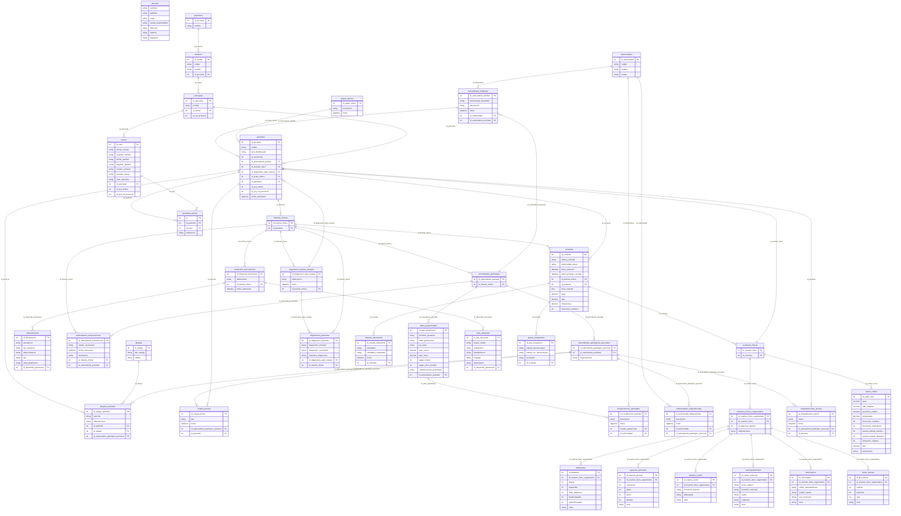

```mermaid
erDiagram
  abdomenes {
    int id_abdomen PK
    int id_examen_fisico_segmentario FK
    int blando
    int depresible
    int dolor_palpacion
    int hepatomegalia
    int esplenomegalia
    string otros
  }
  alergias {
    int id_alergia PK
    string tipo_alergia
    string estado
  }
  alergias_pacientes {
    int id_alergia_paciente PK
    string reaccion
    string observaciones
    int id_paciente FK
    int id_alergia FK
    int id_antecedente_patologico_personal FK
  }
  alimentaciones {
    int id_alimentacion PK
    string descripcion
    string tipo_lactancia
    string edad_lactancia
    string tipo
    string edad_ablactacion
    int id_desarrollo_psicomotor FK
  }
  antecedentes_familiares {
    int id_antecedente_familiar PK
    string enfermedad_hereditaria
    string descripcion
    datetime fecha
    int id_enfermedad FK
    int id_antecedente_perinatal FK
  }
  antecedentes_inmunizaciones {
    int id_antecedente_inmunizacion PK
    string estado_vacunacion
    datetime fecha_vacunacion
    string descripcion
    int id_historia_clinica FK
    int id_antecedente_perinatal FK
  }
  antecedentes_patologicos_personales {
    int id_antecedente_patologico_personal PK
    int id_antecedente_perinatal FK
    string observaciones
  }
  antecedentes_perinatales {
    int id_antecedente_perinatal PK
    int id_historia_clinica FK
  }
  aspectos_generales {
    int id_aspecto_general PK
    int id_examen_fisico_segmentario FK
    int consciente
    int alerta
    int activo
    int decaido
    string otros
  }
  cabezas_cuellos {
    int id_cabeza_cuello PK
    int id_examen_fisico_segmentario FK
    string frontanelo_anterior
    string adenopatia
    string otros
  }
  cantones {
    int id_canton PK
    string codigo
    string nombre
    int id_provincia FK
  }
  cardiospulmonares {
    int id_cardio_pulmonar PK
    int id_examen_fisico_segmentario FK
    string ruido_cardiaco
    string murmullo_vesicular
    string soplos
    string crepitante
    string otros
  }
  cirugias_previas {
    int id_cirugia_previa PK
    string tipo
    datetime fecha
    int id_antecedente_patologico_personal FK
    int id_paciente FK
  }
  complicaciones_perinatales {
    int id_complicacion_perinatal PK
    string descripcion
    datetime fecha
    int id_dato_gestacional FK
    int id_enfermedad FK
  }
  consultas {
    int id_consulta PK
    string motivo_consulta
    string enfermedad_actual
    datetime fecha_atencion
    datetime fecha_proxima_consulta
    int id_historia_clinica FK
    int id_paciente FK
    time hora_consulta
    decimal peso
    decimal talla
    decimal temperatura
    int frecuencia_cardiaca
  }
  datos_gestacionales {
    int id_dato_gestacional PK
    string producto_gestacion
    string edad_gestacional
    string via_parto
    decimal peso_nacer
    decimal talla_nacer
    int apgar_minuto
    int apgar_cinco_minutos
    string complicaciones_perinatales
    int id_antecedente_perinatal FK
  }
  desarrollos_psicomotores {
    int id_desarrollo_psicomotor PK
    string observacion
    int id_historia_clinica FK
    datetime fecha_evaluacion
  }
  diagnosticos_pacientes {
    int id_diagnostico_paciente PK
    string diagnostico_principal
    string diagnostico_secundario
    string impresion_diagnostica
    int id_diagnostico_plan_manejo FK
    int id_historia_clinica FK
  }
  diagnosticos_planes_manejos {
    int id_diagnostico_plan_manejo PK
    string observacion
    datetime fecha
    int id_historia_clinica FK
  }
  enfermedades {
    int id_enfermedad PK
    string codigo
    string nombre
    string estado
  }
  enfermedades_diagnosticadas {
    int id_enfermedad_diagnosticada PK
    string descripcion
    datetime fecha
    int id_enfermedad FK
    int id_antecedente_patologico_personal FK
  }
  estudios_laboratorios {
    int id_estudio_laboratorio PK
    string solicitados
    string resultados_relevantes
    datetime fecha
    int id_consulta FK
  }
  examenes_fisicos {
    int id_examen_fisico PK
    int id_consulta FK
  }
  examenes_fisicos_segmentarios {
    int id_examen_fisico_segmentario PK
    int id_examen_fisico FK
    int id_aspectos_general
    string observaciones
  }
  grupos_etnicos {
    int id_grupo_etnico PK
    string descripcion
    datetime fecha
  }
  historias_clinicas {
    int id_historia_clinica PK
    int id_paciente FK
  }
  hitos_desarrollo {
    int id_hito_desarrollo PK
    string sosten_cefalio
    string sedestacion
    string deambulacion
    string lenguaje
    string observacion
    int id_desarrollo_psicomotor FK
  }
  hospitalizaciones_previas {
    int id_hospitalizacion_previa PK
    string causa
    datetime fecha
    int id_antecedente_patologico_personal FK
    int id_paciente FK
  }
  neurologicos {
    int id_neurologico PK
    int id_examen_fisico_segmentario FK
    string reflejo_osteotendinoso
    string estado_mental
    string tono_muscular
    string otros
  }
  pacientes {
    int id_paciente PK
    string cedula
    string tipo_identificacion
    int id_psicomotor
    int id_antecedente_familiar FK
    int id_examen_fisico FK
    int id_diagnostico_plan_manejo FK
    int id_grupo_etnico FK
    int id_parroquia FK
    int id_prq_canton
    int id_prq_cnt_provincia
    datetime fecha_nacimiento
  }
  pacientes_tutores {
    int id PK
    int id_paciente FK
    int id_tutor FK
    string parentesco
  }
  parroquias {
    int id_parroquia PK
    string nombre
    int id_canton FK
    int id_cnt_provincia
  }
  personal {
    string nombres
    string apellidos
    string cargo
    string estado_disponibilidad
    string direccion
    string telefono
    string password
  }
  pieles_faneras {
    int id_piel_fanera PK
    int id_examen_fisico_segmentario FK
    int icterisia
    int psianosis
    int rash
    string otros
  }
  planes_terapeuticos {
    int id_plan_terapeutico PK
    string manejo_farmacologico
    string manejo_no_farmacologico
    string pronostico
    int id_consulta FK
  }
  provincias {
    int id_provincia PK
    string nombre
  }
  signos_vitales {
    int id_signo_vital PK
    decimal peso
    decimal talla_longitud
    decimal perimetro_cefalico
    decimal temperatura
    int frecuencia_cardiaca
    int frecuencia_respiratoria
    int presion_arterial_sistolica
    int presion_arterial_diastolica
    int saturacion_oxigeno
    decimal IMC
    string puntuacionz
  }
  tutores {
    int id_tutor PK
    string primer_nombre
    string segundo_nombre
    string primer_apellido
    string segundo_apellido
    string numero_contacto
    string domicilio_actual
    string nivel_educativo
    int id_parroquia FK
    int id_prq_canton
    int id_prq_cnt_provincia
  }
  examenes_fisicos_segmentarios ||--o{ abdomenes : "id_examen_fisico_segmentario"
  pacientes ||--o{ alergias_pacientes : "id_paciente"
  alergias ||--o{ alergias_pacientes : "id_alergia"
  antecedentes_patologicos_personales ||--o{ alergias_pacientes : "id_antecedente_patologico_personal"
  desarrollos_psicomotores ||--o{ alimentaciones : "id_desarrollo_psicomotor"
  enfermedades ||--o{ antecedentes_familiares : "id_enfermedad"
  antecedentes_perinatales ||--o{ antecedentes_familiares : "id_antecedente_perinatal"
  historias_clinicas ||--o{ antecedentes_inmunizaciones : "id_historia_clinica"
  antecedentes_perinatales ||--o{ antecedentes_inmunizaciones : "id_antecedente_perinatal"
  antecedentes_perinatales ||--o{ antecedentes_patologicos_personales : "id_antecedente_perinatal"
  historias_clinicas ||--o{ antecedentes_perinatales : "id_historia_clinica"
  examenes_fisicos_segmentarios ||--o{ aspectos_generales : "id_examen_fisico_segmentario"
  examenes_fisicos_segmentarios ||--o{ cabezas_cuellos : "id_examen_fisico_segmentario"
  provincias ||--o{ cantones : "id_provincia"
  examenes_fisicos_segmentarios ||--o{ cardiospulmonares : "id_examen_fisico_segmentario"
  antecedentes_patologicos_personales ||--o{ cirugias_previas : "id_antecedente_patologico_personal"
  pacientes ||--o{ cirugias_previas : "id_paciente"
  datos_gestacionales ||--o{ complicaciones_perinatales : "id_dato_gestacional"
  enfermedades ||--o{ complicaciones_perinatales : "id_enfermedad"
  historias_clinicas ||--o{ consultas : "id_historia_clinica"
  pacientes ||--o{ consultas : "id_paciente"
  antecedentes_perinatales ||--o{ datos_gestacionales : "id_antecedente_perinatal"
  historias_clinicas ||--o{ desarrollos_psicomotores : "id_historia_clinica"
  diagnosticos_planes_manejos ||--o{ diagnosticos_pacientes : "id_diagnostico_plan_manejo"
  historias_clinicas ||--o{ diagnosticos_pacientes : "id_historia_clinica"
  historias_clinicas ||--o{ diagnosticos_planes_manejos : "id_historia_clinica"
  enfermedades ||--o{ enfermedades_diagnosticadas : "id_enfermedad"
  antecedentes_patologicos_personales ||--o{ enfermedades_diagnosticadas : "id_antecedente_patologico_personal"
  consultas ||--o{ estudios_laboratorios : "id_consulta"
  consultas ||--o{ examenes_fisicos : "id_consulta"
  examenes_fisicos ||--o{ examenes_fisicos_segmentarios : "id_examen_fisico"
  pacientes ||--o{ historias_clinicas : "id_paciente"
  desarrollos_psicomotores ||--o{ hitos_desarrollo : "id_desarrollo_psicomotor"
  antecedentes_patologicos_personales ||--o{ hospitalizaciones_previas : "id_antecedente_patologico_personal"
  pacientes ||--o{ hospitalizaciones_previas : "id_paciente"
  examenes_fisicos_segmentarios ||--o{ neurologicos : "id_examen_fisico_segmentario"
  antecedentes_familiares ||--o{ pacientes : "id_antecedente_familiar"
  examenes_fisicos ||--o{ pacientes : "id_examen_fisico"
  diagnosticos_planes_manejos ||--o{ pacientes : "id_diagnostico_plan_manejo"
  grupos_etnicos ||--o{ pacientes : "id_grupo_etnico"
  parroquias ||--o{ pacientes : "id_parroquia"
  pacientes ||--o{ pacientes_tutores : "id_paciente"
  tutores ||--o{ pacientes_tutores : "id_tutor"
  cantones ||--o{ parroquias : "id_canton"
  examenes_fisicos_segmentarios ||--o{ pieles_faneras : "id_examen_fisico_segmentario"
  consultas ||--o{ planes_terapeuticos : "id_consulta"
  examenes_fisicos ||--o{ signos_vitales : "id_examen_fisico"
  parroquias ||--o{ tutores : "id_parroquia"
```
